<p align="center">
  
</p>

<p align="center">
  
</p>

<h1 align="center">🎬 ROADS TO DOOMSDAY — MCU Watch Tracker</h1>

An animated, ticket-punching watchlist for the road to **Avengers: Doomsday** — every stop from *Iron Man* to the finish line, sorted into the Infinity, Multiverse, and Doomsday sagas.

<p align="center">
  <a href="https://mennaabdelelhady.github.io/mcu-watchlist/">
    
  </a>
  <a href="https://mennaabdelelhady.github.io/mcu-watchlist/checklist.html">
    
  </a>
</p>

<p align="center">
  <code>https://mennaabdelelhady.github.io/mcu-watchlist/</code> · <code>/checklist.html</code>
</p>

Two trackers, two ways to watch:
- **Roads to Doomsday** — the 39-film theatrical viewing order leading up to *Avengers: Doomsday*.
- **Full MCU Rewatch Checklist** — every movie *and* Disney+ series, organized by Saga and Phase (Phase One through Phase Six).

No install, no login, no Pym Particles required — just click and start punching tickets.

---

## What's inside
- 🎞️ **Film-strip layout**, grouped by saga, sprocket holes and all
- 🎟️ **Ticket-punch animation** — tap a movie once you've watched it
- 📊 **Progress reel** that fills up as you go, with a live watched count
- 🔍 **Filters** — All / Watched / Unwatched
- ⚡ Zero dependencies — pure HTML/CSS/JS, no frameworks, no build step

## Run it locally
Clone the repo and just open `index.html` in a browser:
```bash
git clone https://github.com/mennaabdelelhady/mcu-watchlist.git
cd mcu-watchlist
```
Then double-click `index.html`, or serve the folder with any static server.

## Deploying your own copy
1. Fork this repo.

2. Repo **Settings → Pages** → set source to the `main` branch, root folder.
3. It'll go live at `https://<your-username>.github.io/mcu-watchlist/`.

## Heads up
Progress is saved in your browser's local storage, so it'll still be there next time you visit — on the same device and browser. Clearing your browser data (or switching devices) will reset it. There's a "Reset all progress" button at the bottom of the page if you want a clean slate.

---

*Assembled for anyone trying to survive the road to Doomsday, one movie night at a time.*
